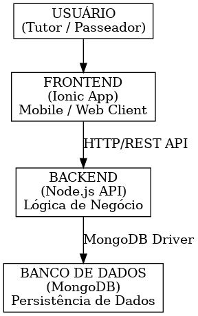

# Arquitetura do Sistema

Este documento descreve a arquitetura do aplicativo Cãominhada, detalhando seus componentes, padrões arquiteturais e as decisões técnicas que fundamentaram sua concepção.

## 1. Descrição da Arquitetura Cliente-Servidor

A arquitetura do aplicativo adota um modelo **cliente-servidor**, onde o cliente (aplicativo móvel/web) interage com um servidor centralizado para acessar e manipular dados. O cliente é responsável pela interface do usuário e pela apresentação das informações, enquanto o servidor gerencia a lógica de negócio, a persistência de dados e a comunicação com o banco de dados. Essa separação de responsabilidades permite maior escalabilidade, flexibilidade e manutenibilidade do sistema.

## 2. Componentes do Sistema

O sistema é composto por três camadas principais, cada uma com responsabilidades bem definidas:

*   **Frontend (Ionic App):** A camada de apresentação, desenvolvida com o framework Ionic, que permite a criação de um aplicativo multiplataforma (iOS, Android e Web) a partir de uma única base de código. É responsável por interagir com o usuário, coletar entradas e exibir informações, comunicando-se com o Backend via API REST.

*   **Backend (Node.js API):** A camada de lógica de negócio e serviços, implementada em Node.js. Atua como um servidor de API RESTful, processando as requisições do Frontend, aplicando as regras de negócio e interagindo com o banco de dados. É responsável pela autenticação, autorização e pela gestão dos recursos do sistema (usuários, pets, passeios, passeadores).

*   **Banco de Dados (MongoDB):** A camada de persistência de dados, utilizando o MongoDB, um banco de dados NoSQL baseado em documentos. Armazena todas as informações do aplicativo, como dados de usuários, pets, passeadores e agendamentos de passeios. Sua flexibilidade permite um esquema dinâmico, facilitando a evolução do modelo de dados.

## 3. Padrões Arquiteturais Utilizados

*   **REST (Representational State Transfer):** O Backend expõe uma API RESTful, que utiliza os métodos HTTP (GET, POST, PUT, DELETE) para realizar operações sobre os recursos do sistema. Isso garante uma comunicação padronizada, stateless e escalável entre o Frontend e o Backend.

*   **MVC Simplificado (Model-View-Controller):** Embora não seja um MVC clássico, o Frontend (Ionic) e o Backend (Node.js) podem ser vistos como implementando princípios de separação de responsabilidades semelhantes. No Frontend, o Ionic gerencia a 

camada de View e parte do Controller, enquanto o Backend lida com o Model e o restante do Controller, processando a lógica de negócio.

## 4. Diagrama de Arquitetura

## 5. Decisões Técnicas e Justificativas

As escolhas tecnológicas foram baseadas em critérios de simplicidade, agilidade no desenvolvimento, flexibilidade e adequação ao contexto de um projeto individual com foco em multiplataforma.

*   **Node.js para o Backend:**
    *   **Justificativa:** Permite o desenvolvimento rápido de APIs RESTful devido à sua natureza assíncrona e orientada a eventos. A vasta comunidade e o ecossistema de pacotes (npm) aceleram o desenvolvimento. É uma escolha robusta para aplicações que demandam alta concorrência e escalabilidade.

*   **Ionic para o Frontend:**
    *   **Justificativa:** Facilita o desenvolvimento de aplicações multiplataforma (iOS, Android e Web) a partir de uma única base de código, utilizando tecnologias web (HTML, CSS, JavaScript). Isso reduz significativamente o tempo e o custo de desenvolvimento, ideal para um projeto individual.

*   **MongoDB para o Banco de Dados:**
    *   **Justificativa:** Como um banco de dados NoSQL orientado a documentos, o MongoDB oferece grande flexibilidade no esquema de dados, o que é vantajoso em fases iniciais de projetos onde os requisitos podem evoluir. Sua escalabilidade horizontal e performance para grandes volumes de dados também são pontos fortes.
