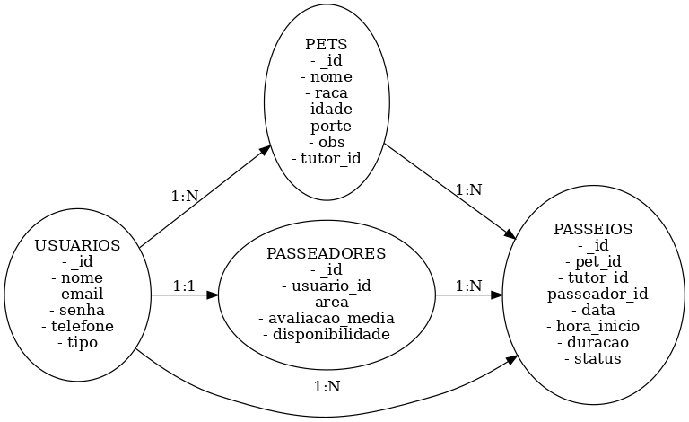

# Modelo de Dados do Banco de Dados

Este documento descreve o modelo de dados para o aplicativo Cãominhada, detalhando as coleções principais, suas entidades, relacionamentos e um dicionário de dados simplificado.

## 1. Coleções Principais

O banco de dados MongoDB será composto pelas seguintes coleções principais:

*   `usuarios`: Armazena informações de tutores e passeadores.
*   `pets`: Armazena informações dos animais de estimação, vinculados aos tutores.
*   `passeadores`: Armazena informações específicas dos passeadores, complementando os dados de `usuarios`.
*   `passeios`: Armazena os agendamentos de passeios, vinculando pets, tutores e passeadores.

## 2. Descrição das Entidades e Relacionamentos

### Entidades:

*   **Usuário (`usuarios`):** Representa tanto o tutor quanto o passeador. Contém informações básicas de autenticação e contato. Um usuário pode ser um tutor, um passeador, ou ambos (embora para simplificação inicial, um usuário será primariamente um ou outro).
*   **Pet (`pets`):** Representa um animal de estimação. Cada pet pertence a um único tutor.
*   **Passeador (`passeadores`):** Representa um profissional que oferece serviços de passeio. Contém informações adicionais específicas do passeador, como área de atuação e disponibilidade. Um passeador é também um usuário.
*   **Passeio (`passeios`):** Representa um agendamento de passeio. Vincula um pet, um tutor e um passeador, além de detalhes do passeio como data, hora e status.

### Relacionamentos:

*   **`usuarios` 1:N `pets`:** Um usuário (tutor) pode ter múltiplos pets. Cada pet pertence a um único usuário.
*   **`usuarios` 1:1 `passeadores`:** Um usuário pode ser um passeador. Para simplificação, consideraremos que a coleção `passeadores` complementa a coleção `usuarios` com informações específicas de passeador.
*   **`pets` N:M `passeios`:** Um pet pode ter múltiplos passeios agendados. Um passeio é para um único pet.
*   **`passeadores` N:M `passeios`:** Um passeador pode realizar múltiplos passeios. Um passeio é realizado por um único passeador.
*   **`usuarios` N:M `passeios`:** Um usuário (tutor) pode agendar múltiplos passeios. Um passeio é agendado por um único tutor.

## 3. Diagrama ER Simplificado

*Nota: O relacionamento entre `PASSEADORES` e `USUARIOS` é de 1:1, onde `PASSEADORES` é uma extensão de `USUARIOS` com atributos específicos de passeador. O `passeador_id` em `PASSEIOS` referencia o `_id` da coleção `passeadores`, que por sua vez referencia o `_id` da coleção `usuarios`.* 

## 4. Dicionário de Dados

### Coleção: `usuarios`

| Atributo   | Tipo     | Descrição                                        | Observações                                      |
| :--------- | :------- | :----------------------------------------------- | :----------------------------------------------- |
| `_id`      | ObjectId | Identificador único do usuário                   | Gerado automaticamente pelo MongoDB              |
| `nome`     | String   | Nome completo do usuário                         | Obrigatório                                      |
| `email`    | String   | Endereço de e-mail do usuário                    | Único, usado para login                          |
| `senha`    | String   | Senha do usuário (hash)                          | Armazenada como hash para segurança              |
| `telefone` | String   | Número de telefone do usuário                    | Opcional                                         |
| `tipo`     | String   | Tipo de usuário (`tutor`, `passeador`, `admin`) | Define o papel do usuário no sistema             |
| `createdAt`| Date     | Data de criação do registro                      | Gerado automaticamente                           |
| `updatedAt`| Date     | Data da última atualização do registro           | Gerado automaticamente                           |

### Coleção: `pets`

| Atributo   | Tipo     | Descrição                                        | Observações                                      |
| :--------- | :------- | :----------------------------------------------- | :----------------------------------------------- |
| `_id`      | ObjectId | Identificador único do pet                       | Gerado automaticamente pelo MongoDB              |
| `nome`     | String   | Nome do pet                                      | Obrigatório                                      |
| `raca`     | String   | Raça do pet                                      | Opcional                                         |
| `idade`    | Number   | Idade do pet em anos                             | Opcional                                         |
| `porte`    | String   | Porte do pet (`pequeno`, `medio`, `grande`)      | Obrigatório                                      |
| `obs`      | String   | Observações e características especiais do pet   | Opcional (ex: alergias, medos)                   |
| `tutor_id` | ObjectId | Referência ao `_id` do tutor proprietário        | Chave estrangeira para a coleção `usuarios`      |
| `createdAt`| Date     | Data de criação do registro                      | Gerado automaticamente                           |
| `updatedAt`| Date     | Data da última atualização do registro           | Gerado automaticamente                           |

### Coleção: `passeadores`

| Atributo     | Tipo     | Descrição                                        | Observações                                      |
| :----------- | :------- | :----------------------------------------------- | :----------------------------------------------- |
| `_id`        | ObjectId | Identificador único do passeador                 | Gerado automaticamente pelo MongoDB              |
| `user_id` | ObjectId | Referência ao `_id` do usuário associado         | Chave estrangeira para a coleção `usuarios`      |
| `area`       | String   | Área de atuação do passeador                     | Ex: 

Zona Sul, Centro, etc.                               |
| `avaliacao_media`| Number   | Média das avaliações recebidas                   | Calculado a partir dos passeios concluídos       |
| `disponibilidade`| Array    | Horários e dias de disponibilidade do passeador  | Ex: `[{dia: 'seg', inicio: '09:00', fim: '17:00'}]`|
| `createdAt`  | Date     | Data de criação do registro                      | Gerado automaticamente                           |
| `updatedAt`  | Date     | Data da última atualização do registro           | Gerado automaticamente                           |

### Coleção: `passeios`

| Atributo        | Tipo     | Descrição                                        | Observações                                      |
| :-------------- | :------- | :----------------------------------------------- | :----------------------------------------------- |
| `_id`           | ObjectId | Identificador único do passeio                   | Gerado automaticamente pelo MongoDB              |
| `pet_id`        | ObjectId | Referência ao `_id` do pet que fará o passeio    | Chave estrangeira para a coleção `pets`          |
| `tutor_id`      | ObjectId | Referência ao `_id` do tutor que agendou         | Chave estrangeira para a coleção `usuarios`      |
| `passeador_id`  | ObjectId | Referência ao `_id` do passeador                 | Chave estrangeira para a coleção `passeadores`   |
| `data`          | Date     | Data do passeio                                  | Formato ISO 8601                                 |
| `hora_inicio`   | String   | Hora de início do passeio                        | Ex: `10:00`                                      |
| `duracao`       | Number   | Duração do passeio em minutos                    | Ex: `30`, `60`                                   |
| `status`        | String   | Status do passeio (`pendente`, `confirmado`, `recusado`, `concluido`, `cancelado`) | Define o estado atual do passeio                 |
| `observacoes`   | String   | Observações adicionais sobre o passeio           | Opcional                                         |
| `avaliacao_tutor`| Number   | Avaliação do tutor para o passeador (1-5 estrelas)| Preenchido após a conclusão do passeio           |
| `createdAt`     | Date     | Data de criação do registro                      | Gerado automaticamente                           |
| `updatedAt`     | Date     | Data da última atualização do registro           | Gerado automaticamente                           |

